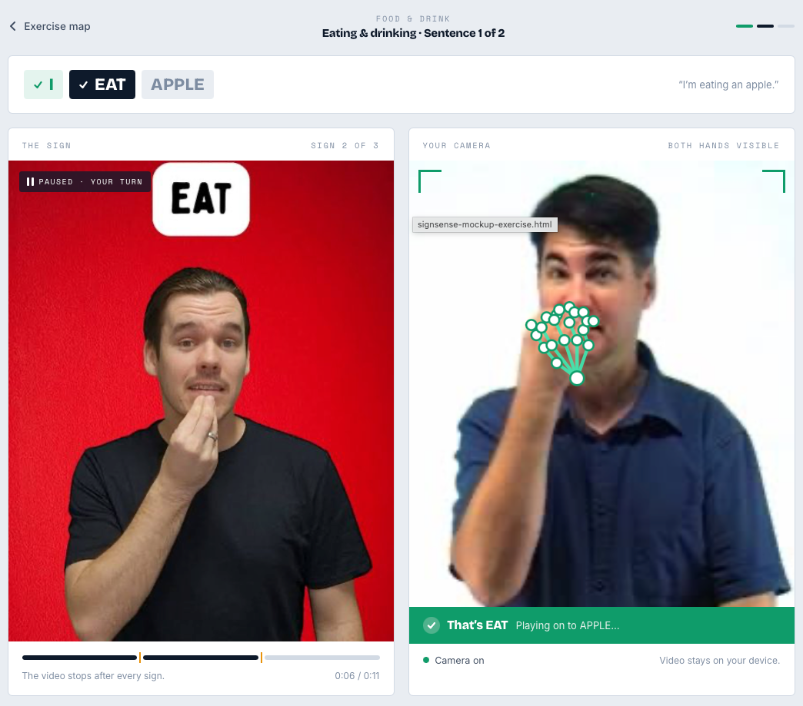
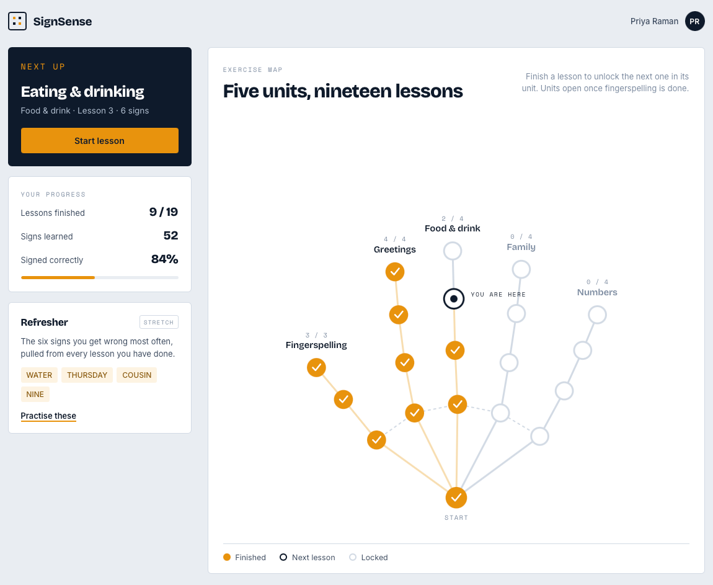

# SignSense — Project Handoff

---

## Overview

SignSense is an application that teaches Auslan through active practice. A learner watches a video of a signed sentence, reproduces each sign in front of their camera, and receives immediate feedback on whether they signed it correctly. Hand tracking and sign recognition are handled by a computer vision model that interprets the live video feed.

---

## Problem it solves

Learning a signed language depends on producing signs and having someone confirm they are correct. Outside of a class or a conversation partner, that feedback is hard to come by. Dictionaries and instructional videos let a learner study what a sign looks like, but give no way to check their own attempt. SignSense closes that loop so learners can practise on their own and know when they have a sign right.

---

## Core functionality

The application is built around a single exercise loop:

1. A video plays an Auslan sentence and pauses after each individual sign.
2. The learner performs that sign to their camera.
3. The video feed is interpreted and the sign is identified.
4. The learner is shown whether the attempt was correct.
5. An incorrect attempt replays the previous sign so the learner can watch it again and retry.

Progress through exercises is saved against the learner's account.

---

## Required scope

| Feature | Description |
| --- | --- |
| Sentence playback | Play a video of an Auslan sentence, pausing after every sign to give the learner a turn. |
| Sign recognition | Interpret the live video feed and identify the sign the learner produces. |
| Correctness feedback | Display clear visual feedback for a correct or incorrect attempt. |
| Replay on error | Replay the preceding sign when an attempt is wrong, so the learner can compare and try again. |
| Exercise map | Present the available exercises in a navigable map that shows what has been completed. |
| Accounts and progress | Provide authentication and an account database that stores each learner's progress. |

### Exercise view:

### Exercise map:

---

## Stretch tasks

These are worth picking up if the required scope is finished early.

- **A larger exercise set.** Extend the content beyond the initial exercises to cover more vocabulary and sentence structures.
- **Refresher section.** Track which signs a learner gets wrong most often and surface them in a dedicated refresher section, separate from the exercise map. Rather than altering the order or content of the exercises themselves, this gives the learner a standalone drill of their weakest signs, following the spaced-repetition approach used by tools like Anki.

---

## Implementation breakdown

### Computer vision on the frontend

Recognition runs entirely in the browser as a two-stage pipeline.

**Stage one — landmark extraction.** MediaPipe's Hand Landmarker task, via the `@mediapipe/tasks-vision` package, reads the webcam feed and returns 21 landmarks per hand with x, y and z coordinates, along with which hand is which. It runs on WebAssembly with a GPU delegate and holds real-time frame rates on ordinary laptops. Because it executes on the device, camera footage never leaves the learner's machine.

**Stage two — classification.** MediaPipe tracks hands but has no knowledge of Auslan, so a second model maps the landmark output onto a specific sign. This model is the team's own work and is the technical core of the project.

There are two approaches to stage two, and choosing between them is a decision for the team:

| Approach | How it works | Trade-off |
| --- | --- | --- |
| Single-frame classifier | MediaPipe Model Maker trains a small classifier on top of the pre-trained hand embedding, using a set of labelled images per sign. Exports directly to the `.task` format the web API consumes. | Fastest route to a working demo, but classifies one frame at a time, so it can only distinguish signs by handshape. Fingerspelling and static signs work; signs defined by movement do not. |
| Sequence classifier | Landmark vectors are buffered across the attempt and a temporal model — an LSTM, 1D CNN or small transformer encoder — classifies the sequence. Trained in Python and exported to run in-browser. | Handles movement correctly and covers a far wider vocabulary. Requires the team to build and train the model themselves, though the input is only a few dozen floats per frame, which keeps data and compute requirements modest. |

The exercise design removes the hardest problem in sign recognition. Segmenting continuous signing into individual signs is difficult, but pausing the video after every sign means the application defines the start and end of each attempt. The classifier therefore only ever sees a clean, bounded clip. This is worth preserving if the interaction design is revisited.

Two constraints to plan around. Handedness can be assigned incorrectly when the hands cross, which matters more for Auslan than for one-handed sign languages, since its fingerspelling alphabet is two-handed throughout. Auslan also carries meaning through facial expression and mouth movement, which hand tracking cannot see; MediaPipe's Face Landmarker could supply this later at additional computational cost, but the initial vocabulary should be chosen so that hand data alone is sufficient.

### Accounts and progress storage

Progress data is small. Each learner needs a record of which exercises they have completed and a tally of attempts and mistakes per sign — a few kilobytes per user that changes a handful of times per session. The storage layer should therefore be chosen for how cleanly it integrates with authentication rather than for throughput.

Google Cloud is the intended platform. The lowest-friction configuration is Firebase Authentication for sign-in paired with Firestore for the progress records, since Firestore's security rules can scope every document to its owner's authenticated user ID without a backend service in between. The frontend writes directly to the database and the rules enforce access. Exercise videos and the trained model bundle can be served as static assets from Cloud Storage or Firebase Hosting.

The alternative is a conventional backend: a small API on Cloud Run, backed by Cloud SQL, validating tokens itself. This is more code and more infrastructure for the same result, but it gives the team a server-side place to put logic if the refresher scheduling or exercise sequencing later needs to run somewhere other than the client. Which of these to build is a decision for the team.

### Website

The web application covers everything around the recognition model: the exercise map, the sentence video player, the camera view, and the feedback display.
